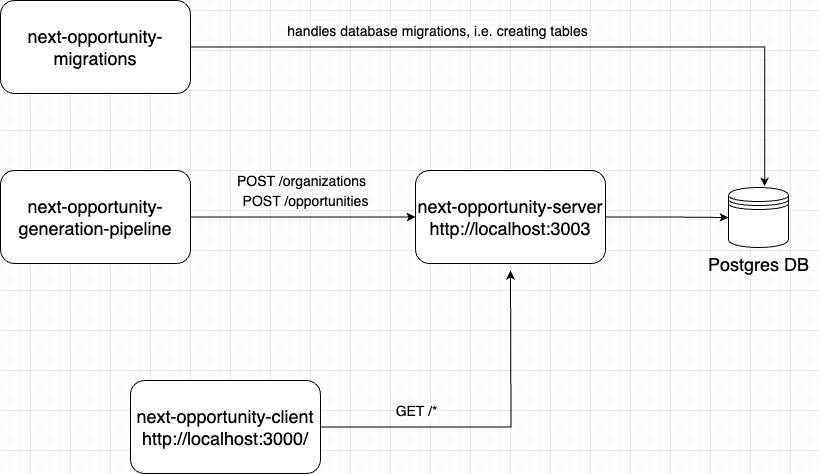

# Next Opportunity Server

This repository is the server side of the next opportunities application. This is built using Express in TypeScript and Knex as a query builder.

## Run Functioning Instance Locally
Head over to [this repository](https://github.com/DanazSdiq/next-opportunity-docker) and follow the instructions on README page 

## How Does All of This Work?

The `next-opportunity-generation-pipeline` service basically looks for pre-defined opportunities off of the web and aggregates them. Then, these opportunities are sent to the `next-opportunity-server` where it is properly stored. This data are stored in Postgres database and `next-opportunity-migrations` service handles the creation of the necessary tables. Finally, the output of all of these services can be viewed in [http://localhost:3000/opportunities](http://localhost:3000/opportunities) locally. 

## Breakdown of Each Respository's Languages/Frameworks:
| Repository Name   | Language  | Technology/Library/Framework  | Repository Link   |
|---    |---    |---    |---    |
| opportunity generation pipeline   | TypeScript    | -     | [link](https://github.com/DanazSdiq/next-opportunity-generation-pipeline)     |
| server    | TypeScript    | Express   | [link](https://github.com/DanazSdiq/next-opportunity-server)  |
| client    | TypeScript    | React     | [link](https://github.com/DanazSdiq/next-opportunity-client)  |
| migrations    | TypeScript    | Knex  | [link](https://github.com/DanazSdiq/next-opportunity-migrations)  |
| docker    | YAML  | Docker and Docker Compose     | [link](https://github.com/DanazSdiq/next-opportunity-docker)  |
